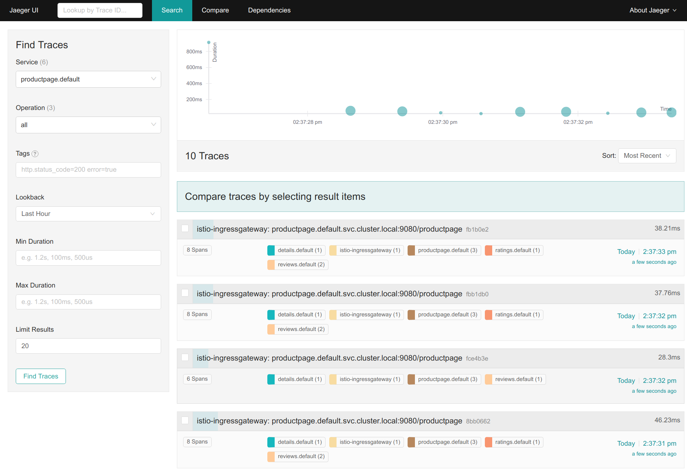

# Jaeger Distributed Tracing on Konvoy

When moving from a Monolithic to Microservices architecture, the application is usually structured as a set of loosely coupled and interdependent services. All the capabilities of the monolith are accomplished by these sets of microservices communicating with each other using synchronous protocols like REST/HTTP or asynchronous protocols like AMQP. This decoupling enables the microservices to use languages frameworks that suit them best. 

When a request is initiated by a specific service it might traverse between several microservices before a response is provided. The request could hop between other microservices which may or may not make queries to several databases for processing the request. As the total number of microservices increases the complexity of the request/response cycle increases as well. When running a microservices based architecture like this in production with heavy load keeping track of failures, errors, delays and anomalies becomes exponentially difficult. Jaeger which is based on OpenTracing initiative traces the request and responses across all the micro-services as a single context and provides better insights into the behaviour of application as a whole. 

Konvoy ships Jaeger as part of the Istio which is deployed by the Istio Operator. The architecture consists of Envoy proxies which act as the clients that capture traces and there is a stand alone tracing deployment which acts as the collector and serves Jaeger UI. Jaeger uses the elastic stack which is deployed as part of Istio as the persistent data store for stored trace information.      

## Jaeger testdrive on Konvoy  

Jaeger is enabled in Konvy out of the box and does not need any additional configuration to get started with Jaeger. Once you have the Konvoy cluster up and running. Advanced configurations can make to Jaeger by passing additional parameters to the Istio Operator which deploys the Jaeger. We will see examples for this in the tasks below 


#### Step 1
Install Istio in your Konvoy cluster but changing the default value of false → true for Istio in the cluster.yaml file
Once done, Trigger the addons built on the cluster and ensure that Istio is installed on the cluster

```bash
Konvoy deploy addons --yes 
```
Output:
```
STAGE [Deploying Enabled Addons]
konvoyconfig                                                           [OK]
reloader                                                               [OK]
dashboard                                                              [OK]
external-dns                                                           [OK]
cert-manager                                                           [OK]
defaultstorageclass-protection                                         [OK]
opsportal                                                              [OK]
gatekeeper                                                             [OK]
traefik                                                                [OK]
awsebscsiprovisioner                                                   [OK]
istio                                                                  [OK]
dex                                                                    [OK]
kube-oidc-proxy                                                        [OK]
traefik-forward-auth                                                   [OK]
dex-k8s-authenticator                                                  [OK]
prometheus                                                             [OK]
velero                                                                 [OK]
prometheusadapter                                                      [OK]
elasticsearch                                                          [OK]
elasticsearch-curator                                                  [OK]
elasticsearchexporter                                                  [OK]
fluentbit                                                              [OK]
kibana                                                                 [OK]
kommander                                                              [OK]

Kubernetes cluster and addons deployed successfully!
```


#### Step 2
Go to the Istio release page to download the installation file for your OS below is the command for Linux & Mac
```bash
curl -L https://istio.io/downloadIstio | sh -  && cd istio*
```
#### Step 3
Label the namespace that will host the application with istio-injection=enabled:
```bash
kubectl label namespace default istio-injection=enabled
```

#### Step 4
Deploy your application using the kubectl command, this command should deploy Bookinfo in Default namespace:
```bash
kubectl apply -f samples/bookinfo/platform/kube/bookinfo.yaml
```
Output:
```
service/details created
serviceaccount/bookinfo-details created
deployment.apps/details-v1 created
service/ratings created
serviceaccount/bookinfo-ratings created
deployment.apps/ratings-v1 created
service/reviews created
serviceaccount/bookinfo-reviews created
deployment.apps/reviews-v1 created
deployment.apps/reviews-v2 created
deployment.apps/reviews-v3 created
service/productpage created
serviceaccount/bookinfo-productpage created
deployment.apps/productpage-v1 created
```
#### Step 5
Validate the service and pods are up and running and also that pods come up with side cars:
```bash
kubectl get po,svc
```
Output:
```
NAME                                  READY   STATUS    RESTARTS   AGE
pod/details-v1-5974b67c8-qv9nr        2/2     Running   0          2m49s
pod/productpage-v1-64794f5db4-wpvvk   2/2     Running   0          2m48s
pod/ratings-v1-c6cdf8d98-kl7lp        2/2     Running   0          2m49s
pod/reviews-v1-7f6558b974-tplkd       2/2     Running   0          2m48s
pod/reviews-v2-6cb6ccd848-qxnmx       2/2     Running   0          2m48s
pod/reviews-v3-cc56b578-lbgtr         2/2     Running   0          2m48s

NAME                  TYPE        CLUSTER-IP    EXTERNAL-IP   PORT(S)    AGE
service/details       ClusterIP   10.0.21.53    <none>        9080/TCP   2m49s
service/kubernetes    ClusterIP   10.0.0.1      <none>        443/TCP    137m
service/productpage   ClusterIP   10.0.40.184   <none>        9080/TCP   2m48s
service/ratings       ClusterIP   10.0.40.73    <none>        9080/TCP   2m49s
service/reviews       ClusterIP   10.0.2.68     <none>        9080/TCP   2m48s
```
#### Step 6
Confirm Bookinfo application is running,  
```bash
kubectl exec -it "$(kubectl get pod -l app=ratings -o jsonpath='{.items[0].metadata.name}')" -c ratings -- curl productpage:9080/productpage | grep -o "<title>.*</title>"
```
Output:
```
<title>Simple Bookstore App</title>
```

#### Step 7
Now that we have the application up and running lets create Istio routing rules using virtual services, gateways and destination rules so that we can acess the application from outside of the cluster 
```bash
kubectl apply -f samples/bookinfo/networking/bookinfo-gateway.yaml
```
Output:
```bash
gateway.networking.istio.io/bookinfo-gateway created
virtualservice.networking.istio.io/bookinfo created
```

```bash
kubectl apply -f samples/bookinfo/networking/destination-rule-all.yaml
```
Output:
```
destinationrule.networking.istio.io/productpage created
destinationrule.networking.istio.io/reviews created
destinationrule.networking.istio.io/ratings created
destinationrule.networking.istio.io/details created
```

#### Step 8 
Set up ingress IP and Ports for external access:
```bash
export INGRESS_HOST=$(kubectl -n istio-system get service istio-ingressgateway -o jsonpath='{.status.loadBalancer.ingress[0].hostname}')
export INGRESS_PORT=$(kubectl -n istio-system get service istio-ingressgateway -o jsonpath='{.spec.ports[?(@.name=="http2")].port}')
export SECURE_INGRESS_PORT=$(kubectl -n istio-system get service istio-ingressgateway -o jsonpath='{.spec.ports[?(@.name=="https")].port}')
export TCP_INGRESS_PORT=$(kubectl -n istio-system get service istio-ingressgateway -o jsonpath='{.spec.ports[?(@.name=="tcp")].port}')

```

#### Step 9
Set the Gateway URL for using the variables set up abovem this might change if we are using NodePort of Private cloud as this example uses AWS  
```bash
export GATEWAY_URL=$INGRESS_HOST:$INGRESS_PORT
```

Validate that the URL is set properly 
```bash
echo $GATEWAY_URL
```
Output:
```
a48ff2201536a4e349ac006ccfc1f5ee-1485992125.us-west-2.elb.amazonaws.com:80
```

You should be able to access the Bookinfo page using the GATEWAY_URL and /productpage suffix either in your browser or using terminal
```bash
curl -s "http://${GATEWAY_URL}/productpage" | grep -o "<title>.*</title>"
```
Lets create some sample traffic to the bookinfo application so that we will have ample data to when working with Jaeger.
```bash
for i in `seq 1 100`; do curl -s -o /dev/null http://$GATEWAY_URL/productpage; done
```

#### Step 10 
Access the Jaeger dashboard by going to the Konvoy ops-portal. If you dont have it already you can run the following command. Once you are on the page click on Jaeger to acccess Jaeger dashboard. Once you have access to the dashboard, from the left-hand pane of the dashboard, select productpage.default from the Service drop-down list and click Find Traces:


```bash
konvoy get ops-portal
```



#### Step 10 
Click on the most recent trace at the top to see the details corresponding to the latest request to the /productpage:


#### Step 11
The trace is comprised of a set of spans, where each span corresponds to a Bookinfo service, invoked during the execution of a /productpage request, or internal Istio component, for example: istio-ingressgateway.
